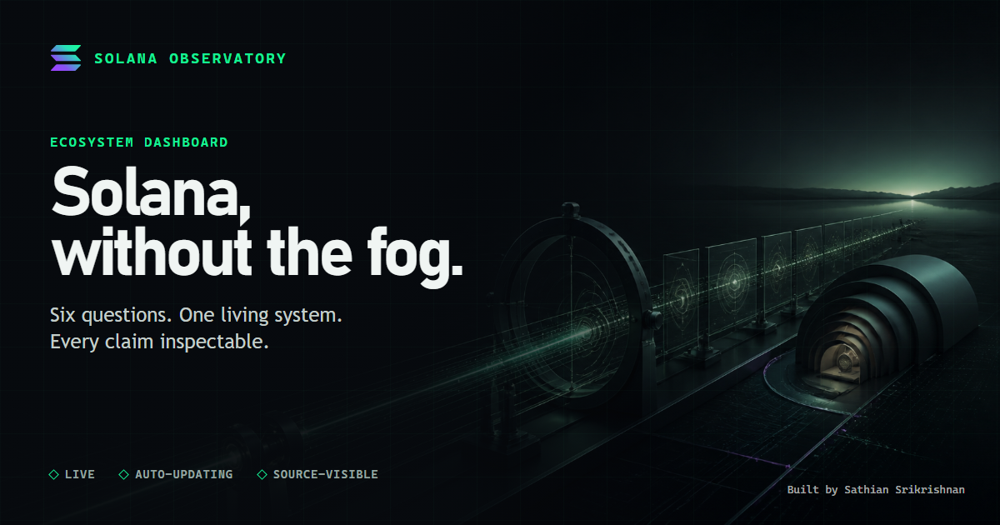

# Solana Observatory

Live dashboard: https://sathiansrikrishnan.github.io/solana-ecosystem-dashboard/



A trustworthy, automatically updating view of Solana's network health,
adoption, economics, validators, ecosystem changes, and financial rails.

Built for the [Superteam Canada Solana Ecosystem Auto-Updating Report &
Interactive Dashboard bounty](https://superteam.fun/earn/listing/develop-solana-ecosystem-auto-updating-report-and-interactive-dashboard).

## What it publishes

- [`output/index.html`](output/index.html): standalone dark interactive dashboard
- [`output/report.md`](output/report.md): human-readable report
- [`output/report.json`](output/report.json): structured facts and provenance
- [`output/solana-observatory-cover.png`](output/solana-observatory-cover.png):
  1200 x 630 social preview
- [`output/solana-six-question-map.png`](output/solana-six-question-map.png):
  1200 x 1200 beginner guide

The same validated snapshot drives all three formats. Every metric carries its
definition, source, collection time, confidence, and a limitation. Wallets are
not labeled as people, raw transfers are not labeled as payments, and a source
failure remains visible instead of becoming zero.

## Run it locally

Python 3.11+ is the only production dependency. Node is used only for the
repeatable Axe accessibility and visual QA checks.

```powershell
# Source / context:
# Solana Observatory local refresh and verification

cd "C:\Users\sathi\Projects\solana-ecosystem-dashboard"

# Commands:
python -m unittest discover -s tests -v
python scripts\generate.py
python scripts\refresh_economy.py --snapshot output\report.json --output output
python scripts\refresh_ecosystem.py --snapshot output\report.json --output output
python scripts\refresh_updates.py --snapshot output\report.json --output output
python scripts\refresh_dune.py --snapshot output\report.json --output output
npm ci
npm run test:social
npm run build:social
npm run test:a11y
npm run test:visual
```

Open `output/index.html` after the refresh completes.

## Data integration

| Source | What it supplies | Access and failure behavior |
|---|---|---|
| Solana JSON-RPC | health, slots, blocks, epoch, TPS, slot time, recent fees, validators and stake | Public/no-key; refreshed first |
| Dune | successful fee payers/signers, Jupiter signers, overlap and return rate | Optional `DUNE_API_KEY`; stale stored results are labeled instead of presented as current |
| DeFiLlama | TVL, stablecoins, DEX volume, chain/app fees, app revenue and tracked Jito tips | Public/no-key; sources fail independently |
| CoinGecko | SOL price and 24-hour movement | Public/no-key; bounded request |
| Solana RSS and upgrade pages | current official news, Alpenglow roadmap | Public/no-key; editorial source is explicitly labeled |
| Solana SIMD repository | SIMD-0525 proposal status | Public/no-key; proposal status is not deployment status |
| RWA.xyz | non-stablecoin tokenized-asset value | Optional authenticated adapter remains a documented gap |

The production collectors use Python's standard library. Authenticated sources
are optional and never silently become required for the dashboard to publish.

## Automation

`.github/workflows/refresh.yml` runs every six hours and can also be started
manually. It:

1. runs the Python tests;
2. refreshes RPC, economy, ecosystem, official-news and upgrade data;
3. attempts a Dune stored-result refresh when `DUNE_API_KEY` is configured and
   visibly marks only those metrics stale when freshness validation fails;
4. runs desktop and mobile Axe checks;
5. commits changed report outputs.

`.github/workflows/pages.yml` deploys `output/` to GitHub Pages after changes
reach `main`. Concurrency guards prevent overlapping refreshes and deployments.

`.github/workflows/dune-adoption.yml` checks once a day whether the oldest
verified Dune adoption date is at least three UTC days old. Only then does it
execute the three bounded queries, refresh the five adoption measurements, and
commit the new outputs. If provider capacity prevents execution, the workflow
preserves the last verified values, marks them stale, and continues publishing
the no-key core instead of purchasing capacity or hiding the failure. The
dashboard's **Check for latest data** button only
checks for a newer published `report.json`; it cannot run a query, access the
secret, or consume credits.

The Dune API requires authentication. Configure it without exposing the value:

```powershell
# Source / context:
# Optional automatic Dune result refresh

cd "C:\Users\sathi\Projects\solana-ecosystem-dashboard"

# Commands:
gh secret set DUNE_API_KEY
```

The repository secret is configured. An explicitly approved bounded execution
on 2026-08-11 published adoption results through 2026-08-10, the latest complete
UTC day, using 17.6844 included credits and $0 cash spend. Sathian approved a
three-day recurring cadence. At the measured rate, that is approximately 180
included credits per month, with the account's extra-credit limit remaining $0.

### What Dune does—and does not do

Dune is the adoption microscope, not the dashboard's foundation. It supplies
five historical measurements that public Solana RPC cannot answer efficiently:
successful fee payers, successful signers, Jupiter swap signers, Jupiter/signers
overlap, and seven-day return cohorts. Network, economy, validator, ecosystem,
price, and stablecoin measurements continue without Dune.

This project does not require a paid Dune subscription. The account receipt in
[`docs/COSTS.md`](docs/COSTS.md) records a free allowance, a $0 extra-credit
limit, and $0 cash spend. Dune API executions and CSV/API result retrieval do
consume credits. The dedicated workflow executes only when the oldest verified
adoption date is three days old; between executions, the normal refresh keeps
and labels the last verified result. A repository maintainer can also use the
manual workflow switch for a bounded execution. Dune's current
[billing documentation](https://docs.dune.com/api-reference/overview/billing)
and [credit guide](https://docs.dune.com/resources/credits-billing/how-credits-work)
explain that behavior.

## Bounty proof at a glance

| Sponsor expectation | Inspectable proof |
|---|---|
| Auto-updating report | Six-hour GitHub Actions workflow with visible source degradation |
| Interactive dashboard | Public GitHub Pages demo, evidence drawers, section navigation and sparklines |
| Core ecosystem coverage | Six linked layers and 45 source-carrying metric records |
| Anomaly detection | Deterministic TPS, slot-time, validator-delinquency, SOL-price and economic checks |
| Reproducibility | One validated JSON contract generates HTML and Markdown; tests and setup are public |
| Beginner usability | Thirty-second reading path, six-question map, plain-English definitions and risks |

## Anomaly detection

Deterministic rules flag evidence for review without calling movement good or
bad. Four sponsor-named operational checks cover:

- non-vote TPS versus the median of recent RPC samples (25%);
- slot time versus the median of recent RPC samples (20%);
- delinquent stake share (5%);
- SOL's 24-hour price move (10%).

Fourteen-day economic series also compare the latest seven complete UTC days
with the preceding seven and flag absolute movement of at least 15%. Thresholds
are code-visible, tests cover both sides, and insufficient evidence is reported
as unavailable rather than anomalous.

The overview exposes the review queue, and supported metric series include
compact accessible sparklines. Validators include a live top-ten vote-account
table alongside concentration, delinquency, commission, and superminority
measurements. Vote accounts are ranked without claiming they are distinct
operators.

## How to interpret it

Start with the six overview questions. A green reporting badge means the source
returned valid data; it is not a verdict that Solana is healthy. Follow any
movement into its evidence drawer and read the definition and limitation before
drawing a conclusion. The deterministic briefing may summarize validated
records but cannot identify causes.

## Known boundaries

- Dune authentication and bounded execution are configured on a three-day
  cadence. If execution or retrieval fails, the saved result remains visibly
  labeled rather than being silently backfilled.
- RWA.xyz's no-key API returns unauthorized, and full API plus redistribution
  rights require an enterprise agreement. Tokenized-asset value is therefore
  not scraped or backfilled from press releases.
- Raw stablecoin transfer volume is not presented as payment volume.
- Official news is one editorial feed, not total community sentiment.

For architecture and research, see [the big-picture map](docs/BIG-PICTURE-MAP.md),
[metric registry](docs/METRIC-REGISTRY.md), [release checklist](docs/RELEASE-CHECKLIST.md),
[final usefulness and gap map](docs/PRODUCT-USEFULNESS-AND-FINAL-GAPS.md), and
[official bounty audit](docs/research/2026-08-10-SUPERTEAM-BOUNTY-REQUIREMENTS-AUDIT.md).
