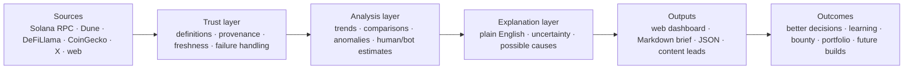
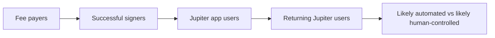

# Big-Picture Map

## The product in one sentence

Build a trustworthy Solana morning briefing that shows what is happening, what
changed, what it might mean, how certain we are, and what deserves attention.

## How the system fits together

The first three boxes create trustworthy knowledge. The last three make that
knowledge useful.

## What the finished dashboard should feel like

### Opening screen

- Is Solana healthy right now?
- What changed since yesterday or last week?
- Which three signals deserve attention?
- When was each source last updated?

### Network

TPS, non-vote TPS, slot time, epoch progress, block height, and network health.

### Adoption

Fee payers, successful signers, app users, returning wallets, likely automation,
and conservative likely-human estimates. Definitions remain visible.

### Economy

SOL price, stablecoin supply, DEX volume, TVL, fees, REV, and tokenized assets.

### Validators

Active and delinquent validators, stake concentration, commissions, and alerts.

### Ecosystem watch

Important applications, announcements, upgrades, proposals, and unusual changes
from selected X and web sources.

### Methods

Every metric's exact definition, source, freshness, confidence, and caveat.

## Build roadmap

| Phase | What it contributes | Status |
|---|---|---|
| 0. Foundation | Public repo, tests, three report formats, six-hour automation | Complete |
| 1. Live network | Direct RPC health and validator snapshot | Complete |
| 2. Adoption identities | Dune wallet/signature/app/retention comparisons | Current |
| 3. Economy | Price, TVL, stablecoins, DEX volume, fees, REV, tokenized assets | Next |
| 4. Validator depth | Stake distribution, commission, delinquency history | Planned |
| 5. Ecosystem watch | X, reports, upgrades, proposals, app changes | Planned |
| 6. Intelligence | Anomalies, correlations, grounded AI explanation | Planned |
| 7. Product finish | Responsive design, hosting, docs, demo, submission | Planned |

## Why the Jupiter slice matters

The Jupiter lesson is not a side quest. It builds the first trustworthy piece of
the Adoption section:

Each step makes the population smaller but more meaningful. We keep the earlier
numbers visible so the audience can see how the interpretation was formed.

## Sathian's role

At every phase, Sathian answers:

1. Is this question useful?
2. Does the definition match the claim?
3. Does the result seem believable?
4. What should a builder do with this information?

Codex researches, implements, tests, automates, and records the evidence.

## Definition of winning

- A newcomer understands the top screen in 30 seconds.
- A serious analyst can inspect and trust the methodology.
- A builder discovers a useful signal worth investigating.
- The repository runs easily and continues updating after the bounty.

## Execution map

The pull-request and worktree sequence lives in `docs/ROADMAP-PR-MAP.md`. The
interface structure and remaining design decisions live in
`docs/INTERFACE-ARCHITECTURE.md`.
